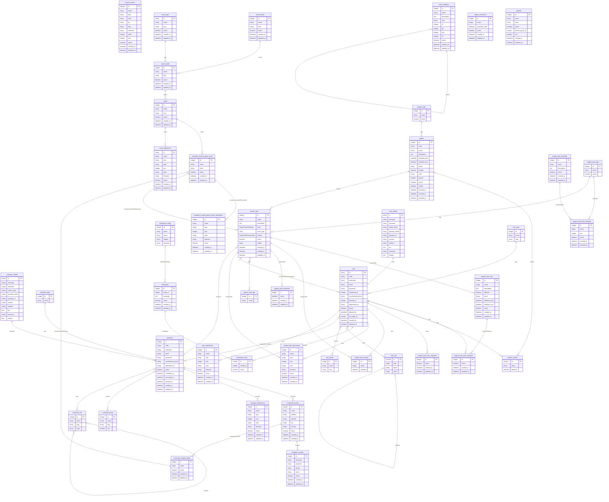

# Schema E/R — app (Doctrine)

> Generato dai metadata Doctrine (`doctrine:mapping:info`). 43 entità.

```mermaid
erDiagram
  access_control {
    integer id PK
    string name
    string path
    string roles
    string ips
    string host
    string methods
    integer allow
    integer sort
    boolean active
    datetime created_at
    datetime updated_at
  }
  asset {
    integer id PK
    string name
    string slug
    boolean active
    datetime created_at
    datetime updated_at
  }
  asset_attachment {
    string id PK
    string name
    string slug
    string type
    integer size
    string path
    string filename
    boolean active
    datetime created_at
    datetime updated_at
  }
  asset_brand {
    integer id PK
    string name
    string slug
    boolean active
    datetime created_at
    datetime updated_at
  }
  asset_category {
    integer id PK
    string name
    text description
    string slug
    integer lft
    integer rgt
    integer root
    integer lvl
    boolean active
    datetime created_at
    datetime updated_at
  }
  asset_model {
    integer id PK
    string name
    string slug
    boolean active
    datetime created_at
    datetime updated_at
  }
  asset_type {
    string id PK
    string name
    string slug
    boolean active
    datetime created_at
    datetime updated_at
  }
  customer {
    integer id PK
    string code
    string username
    string email
    string password
    string unconfirmed_email
    string registration_ip
    boolean active
    datetime confirmed_at
    datetime last_login_at
    datetime blocked_at
    datetime created_at
    datetime updated_at
  }
  customer_attachment {
    integer id PK
    string name
    string type
    integer size
    string path
    string filename
    boolean active
    datetime created_at
    datetime updated_at
  }
  customer_contact {
    integer id PK
    string firstname
    string lastname
    string phone
    string email
    boolean active
    datetime created_at
    datetime updated_at
  }
  customer_group {
    integer id PK
    string name
    string slug
    smallint sort
  }
  customer_location {
    integer id PK
    string name
    string address
    string zipcode
    string city
    string country
    boolean active
    datetime created_at
    datetime updated_at
  }
  customer_location_place {
    integer id PK
    string name
    boolean active
    datetime created_at
    datetime updated_at
  }
  customer_location_place_asset {
    integer id PK
    string name
    string code
    boolean active
    datetime created_at
    datetime updated_at
  }
  customer_location_place_asset_attachment {
    integer id PK
    string name
    string type
    integer size
    string path
    string filename
    boolean active
    datetime created_at
    datetime updated_at
  }
  customer_profile {
    string id PK
    string firstname
    string lastname
    string public_email
    string gravatar_email
    string gravatar_id
    string location
    string website
    text bio
    string timezone
    text setting
  }
  customer_role {
    integer id PK
    string name
    string slug
    string code
  }
  customer_type {
    integer id PK
    string name
  }
  notification {
    integer id PK
    integer entity_id
    text message
    boolean status
    datetime created_at
    datetime updated_at
  }
  notification_entity {
    integer id PK
    string name
    string action
    string subject
    string template
  }
  notification_item {
    integer id PK
    integer sender_id
    smallint status
  }
  project {
    integer id PK
    string code
    string name
    text description
    datetime datetime_start
    datetime datetime_end
    string status
    decimal budget
    string color
    smallint priority
    boolean active
    boolean visible
    datetime finished_at
    datetime created_at
    datetime updated_at
  }
  project_activity {
    integer id PK
    string name
    datetime datetime
  }
  project_milestone {
    integer id PK
    string name
    datetime expiration_date
    boolean active
    datetime created_at
    datetime updated_at
  }
  project_task {
    integer id PK
    string name
    text description
    ProjectTaskStateType state
    string asset_type
    ProjectTaskPriorityType priority
    boolean active
    string visible
    datetime finished_at
    datetime created_at
    datetime updated_at
  }
  project_task_activity {
    integer id PK
    string name
    datetime datetime
  }
  project_task_attachment {
    integer id PK
    string name
    string type
    integer size
    string path
    string filename
    boolean active
    datetime created_at
    datetime updated_at
  }
  project_task_item {
    integer id PK
    string name
    text description
    boolean difficulty
    string value
    datetime datetime_start
    datetime datetime_end
    boolean active
    datetime created_at
    datetime updated_at
  }
  project_task_item_assigned {
    integer id PK
    boolean active
    datetime created_at
    datetime updated_at
  }
  project_task_item_template {
    integer id PK
    string name
    integer sort
    boolean active
    datetime created_at
    datetime updated_at
  }
  project_task_milestone {
    integer id PK
    boolean active
    datetime created_at
    datetime updated_at
  }
  project_task_tag {
    integer id PK
    string name
  }
  project_task_template {
    integer id PK
    string name
    text description
    boolean active
    datetime created_at
    datetime updated_at
  }
  project_task_type {
    integer id PK
    string name
    boolean active
  }
  project_task_user_assigned {
    integer id PK
    boolean active
    datetime created_at
    datetime updated_at
  }
  project_type {
    integer id PK
    string name
    boolean active
  }
  user {
    string id PK
    string code
    string username
    string email
    string password
    integer confirmed_at
    string unconfirmed_email
    integer blocked_at
    string registration_ip
    boolean active
    datetime deleted_at
    integer last_login_at
    datetime created_at
    datetime updated_at
  }
  user_attachment {
    integer id PK
    string name
    string type
    integer size
    string path
    string filename
    boolean active
    datetime created_at
    datetime updated_at
  }
  user_group {
    integer id PK
    string name
    string slug
  }
  user_profile {
    string id PK
    string firstname
    string lastname
    string public_email
    string gravatar_email
    string gravatar_id
    string location
    string website
    text bio
    string timezone
    text setting
  }
  user_role {
    smallint id PK
    string slug
    string name
    string code
  }
  user_type {
    integer id PK
    string name
    string slug
  }
  website {
    integer id PK
    string name
    string code
    boolean active
    integer default_group_id
    smallint sort
    datetime created_at
    datetime updated_at
  }

  customer_location_place_asset ||--o{ customer_location_place_asset_attachment : "customerLocationPlaceAsset"
  customer ||--o{ customer_location : "customer"
  customer_location_place ||--o{ customer_location_place_asset : "customerLocationPlace"
  asset ||--o{ customer_location_place_asset : "asset"
  customer_profile ||--|| customer : "customer"
  customer_location ||--o{ customer_contact : "location"
  customer_role }o--o{ customer_role : "children"
  customer ||--o{ customer_attachment : "customer"
  customer_location ||--o{ customer_location_place : "customerLocation"
  customer_type ||--o{ customer : "type"
  customer }o--o{ customer_group : "groups"
  customer }o--o{ customer_role : "roles"
  project_task_template ||--o{ project_task_item_template : "taskTemplate"
  project_task_type ||--o{ project_task_item_template : "taskType"
  project_task ||--o{ project_task_item : "projectTask"
  user ||--o{ project_task_item_assigned : "user"
  project_task_item ||--o{ project_task_item_assigned : "projectTaskItem"
  user ||--o{ project_activity : "user"
  project ||--o{ project_activity : "project"
  project_type ||--o{ project : "type"
  user ||--o{ project_task_user_assigned : "users"
  user ||--o{ project_task_activity : "user"
  project_task ||--o{ project_task_activity : "projectTask"
  project_task ||--o{ project_task_milestone : "projectTask"
  customer ||--o{ project_task : "customer"
  customer_location_place_asset ||--o{ project_task : "customerLocationPlaceAsset"
  project ||--o{ project_task : "project"
  project_task_type ||--o{ project_task : "type"
  project_task }o--o{ project_task_tag : "tags"
  project_task }o--o{ user : "projectTaskUserAssigneds"
  user ||--o{ project_task_attachment : "user"
  project_task ||--o{ project_task_attachment : "projectTask"
  notification ||--o{ notification_item : "notification"
  user ||--o{ notification_item : "recipient"
  notification_entity ||--o{ notification : "notificationEntity"
  asset_category ||--o{ asset_category : "parent"
  asset ||--o{ asset_attachment : "asset"
  asset_model ||--o{ asset : "model"
  asset_brand ||--o{ asset_model : "brand"
  asset_type ||--o{ asset_model : "type"
  user_profile ||--|| user : "user"
  user }o--o{ user_role : "roles"
  user_type ||--o{ user : "type"
  user }o--o{ user_group : "groups"
  user }o--o{ customer : "assignedCustomers"
  user ||--o{ user_attachment : "user"
  user_role }o--o{ user_role : "children"
```
